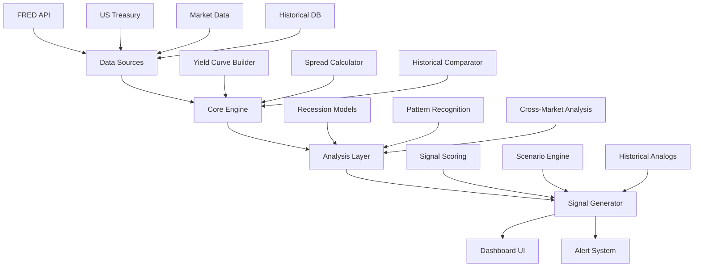
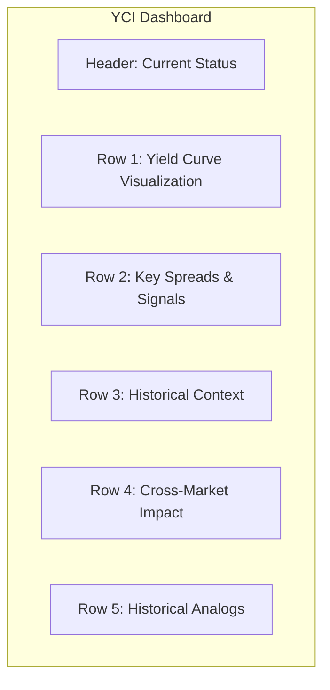
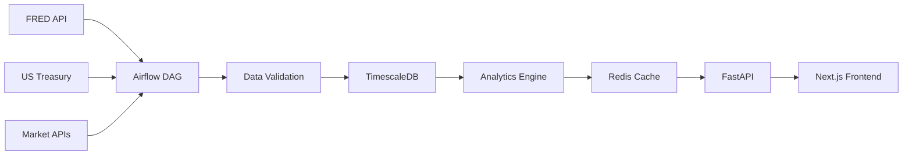

# 📊 ТЗ: Модуль "Yield Curve Intelligence" (YCI)

## Макро-аналитика кривых доходности и прогнозирование межрыночных движений

---

## 1. Общее описание

### 1.1 Назначение
Модуль **Yield Curve Intelligence (YCI)** — это расширение SignalStream Dashboard для анализа кривых доходности казначейских облигаций США (Treasury Yield Curve) и прогнозирования их влияния на глобальные рынки: акции, индексы, FOREX, криптовалюты, сырьевые товары.

### 1.2 Философия модуля
> **"История не повторяется, но рифмуется"** — Марк Твен

Модуль основан на гипотезе, что инверсия кривой доходности и её динамика являются ведущими индикаторами рецессий и переломных моментов на рынках. Историческая ретроспектива за 100+ лет позволяет выявлять паттерны и аналогии.

### 1.3 Ключевые метрики модуля

| Метрика | Описание | Периодичность |
|---------|----------|---------------|
| Yield Curve Spread | Разница 10Y-2Y, 10Y-3M | Ежедневно |
| Recession Probability | Вероятность рецессии (NY Fed модель) | Ежемесячно |
| Bond-Stock Correlation | Корреляция облигаций и акций | Rolling 90d |
| Risk-On/Off Signal | Индекс настроения рынка | Real-time |
| Cross-Market Impact Score | Оценка влияния на разные рынки | Daily |

---

## 2. Архитектура модуля



### 2.1 Компоненты системы

| Компонент | Технология | Описание |
|-----------|------------|----------|
| Data Ingestion | Python + APScheduler | Сбор данных из FRED, Treasury |
| Database | PostgreSQL + TimescaleDB | Исторические данные с 1920х |
| Analytics Engine | Python + pandas/numpy | Расчёт спредов, моделей |
| ML Layer | scikit-learn/TensorFlow | Pattern recognition, forecasting |
| API | FastAPI | REST endpoints для фронтенда |
| Frontend | Next.js + Recharts | Визуализация, интерактивность |

---

## 3. Источники данных

### 3.1 Основные источники

| Источник | Данные | Частота | API |
|----------|--------|---------|-----|
| **FRED** (Federal Reserve) | Treasury yields, recession prob | Daily | ✅ FRED API |
| **US Treasury** | Yield curve data | Daily | ✅ XML/JSON |
| **Yahoo Finance** | Индексы (^GSPC, ^IXIC, ^DJI) | Real-time | ✅ yfinance |
| **Alpha Vantage** | FOREX, сырье | Daily | ✅ REST |
| **Crypto APIs** | BTC, ETH и др. | Real-time | WebSocket |
| **NBER** | Даты рецессий | По факту | CSV |

### 3.2 Исторические данные (since 1920)

```python
# Структура исторической БД
HISTORICAL_DATASETS = {
    "treasury_yields": {
        "3_month": {"start": "1934-01-01", "source": "FRED"},
        "2_year": {"start": "1976-01-01", "source": "FRED"},
        "10_year": {"start": "1920-01-01", "source": "NBER+FRED"},
        "30_year": {"start": "1977-01-01", "source": "FRED"}
    },
    "recession_dates": {
        "nber_cycles": "1854-present",
        "yield_inversions": "1965-present"
    },
    "market_indices": {
        "sp500": {"start": "1927", "source": "Yahoo/CRSP"},
        "dow_jones": {"start": "1896", "source": "Yahoo"},
        "gold": {"start": "1968", "source": "FRED"},
        "oil": {"start": "1946", "source": "EIA/FRED"}
    }
}
```

---

## 4. Алгоритмы анализа

### 4.1 Расчёт кривой доходности

```python
class YieldCurveAnalyzer:
    """
    Расчёт спредов и индикаторов кривой доходности
    """
    
    TENORS = ['3M', '2Y', '5Y', '7Y', '10Y', '30Y']
    
    def calculate_spreads(self, yields: dict) -> dict:
        """
        Ключевые спреды для анализа
        """
        return {
            # Основной индикатор инверсии
            "10Y_2Y": yields['10Y'] - yields['2Y'],
            
            # Предпочтительный индикатор (Fed)
            "10Y_3M": yields['10Y'] - yields['3M'],
            
            # Дополнительные спреды
            "5Y_2Y": yields['5Y'] - yields['2Y'],
            "30Y_10Y": yields['30Y'] - yields['10Y'],
            "10Y_5Y": yields['10Y'] - yields['5Y'],
            
            # Slope индексы
            "short_end_slope": yields['2Y'] - yields['3M'],
            "long_end_slope": yields['30Y'] - yields['10Y'],
            "belly_slope": yields['10Y'] - yields['5Y']
        }
    
    def detect_inversion(self, spreads: dict, days_required: int = 10) -> dict:
        """
        Определение инверсии кривой
        """
        inversion_signals = {
            "status": "NORMAL",  # NORMAL, INVERTED, FLAT
            "type": None,  # FULL, PARTIAL, SHORT_END
            "duration_days": 0,
            "signals": []
        }
        
        # Полная инверсия (10Y-2Y < 0)
        if spreads['10Y_2Y'] < 0:
            inversion_signals["signals"].append("10Y-2Y inverted")
            inversion_signals["type"] = "FULL"
        
        # Инверсия по Fed предпочтительному индикатору
        if spreads['10Y_3M'] < 0:
            inversion_signals["signals"].append("10Y-3M inverted (Fed pref)")
            inversion_signals["status"] = "INVERTED"
        
        # Плоская кривая
        if abs(spreads['10Y_2Y']) < 0.25:
            inversion_signals["status"] = "FLAT"
        
        return inversion_signals
```

### 4.2 Модель вероятности рецессии (NY Fed)

```python
class RecessionProbabilityModel:
    """
    Модель NY Fed на основе спреда 10Y-3M
    
    Формула: P(recession) = f(10Y-3M spread, historical data)
    Источник: https://www.newyorkfed.org/research/capital_markets/ycfaq.html
    """
    
    def calculate_probability(self, spread_10y_3m: float, 
                            months_ahead: int = 12) -> float:
        """
        Расчёт вероятности рецессии через 12 месяцев
        
        На основе логистической регрессии NY Fed:
        P = 1 / (1 + exp(-(β0 + β1 * spread)))
        
        Параметры модели (estimates):
        β0 = -0.5334
        β1 = -0.6330
        """
        beta_0 = -0.5334
        beta_1 = -0.6330
        
        logit = beta_0 + beta_1 * spread_10y_3m
        probability = 1 / (1 + math.exp(-logit))
        
        return {
            "probability_12m": round(probability * 100, 2),
            "spread": spread_10y_3m,
            "signal_strength": self._get_signal_strength(probability),
            "model": "NY Fed Logistic (est.)"
        }
    
    def _get_signal_strength(self, prob: float) -> str:
        if prob < 10: return "LOW"
        if prob < 25: return "MODERATE"
        if prob < 50: return "ELEVATED"
        return "HIGH"
```

### 4.3 Исторический аналоговый движок

```python
class HistoricalAnalogEngine:
    """
    Поиск исторических аналогий текущей ситуации
    """
    
    ANALOGY_DIMENSIONS = [
        "yield_curve_shape",      # Форма кривой
        "spread_levels",          # Уровни спредов
        "inversion_duration",     # Длительность инверсии
        "fed_policy_phase",       # Фаза политики ФРС
        "macro_context",          # Макро-контекст
        "market_valuation",       # Оценка рынков
    ]
    
    HISTORICAL_CASES = [
        # Инверсии → Рецессии
        {"period": "2006-2007", "inversion_start": "2006-01", 
         "recession_start": "2007-12", "lead_time_months": 23,
         "10y2y_min": -0.16, "sp500_change": -57, "context": "Housing bubble"},
        
        {"period": "2000", "inversion_start": "2000-04",
         "recession_start": "2001-03", "lead_time_months": 11,
         "10y2y_min": -0.47, "sp500_change": -49, "context": "Dot-com bubble"},
        
        {"period": "1989", "inversion_start": "1989-05",
         "recession_start": "1990-07", "lead_time_months": 14,
         "10y2y_min": -0.34, "sp500_change": -20, "context": "S&L Crisis"},
        
        {"period": "1981", "inversion_start": "1980-09",
         "recession_start": "1981-07", "lead_time_months": 10,
         "10y2y_min": -2.00, "sp500_change": -27, "context": "Volcker era"},
        
        # Инверсии → Без рецессии (false positive)
        {"period": "1966", "inversion_start": "1966-08",
         "recession_start": None, "lead_time_months": None,
         "10y2y_min": -0.10, "sp500_change": +12, "context": "Soft landing"},
        
        {"period": "1998", "inversion_start": "1998-05",
         "recession_start": None, "lead_time_months": None,
         "10y2y_min": -0.05, "sp500_change": +35, "context": "LTCM/Russia crisis"},
    ]
    
    def find_best_analogs(self, current_state: dict, n: int = 3) -> list:
        """
        Поиск N лучших исторических аналогий
        
        Алгоритм:
        1. Нормализация признаков
        2. Расчёт расстояния (Euclidean weighted)
        3. Ранжирование по схожести
        """
        similarities = []
        
        for case in self.HISTORICAL_CASES:
            score = self._calculate_similarity(current_state, case)
            similarities.append({
                "case": case,
                "similarity_score": score,
                "key_differences": self._identify_differences(current_state, case)
            })
        
        return sorted(similarities, key=lambda x: x["similarity_score"], reverse=True)[:n]
```

---

## 5. Исторические кейсы (база знаний)

### 5.1 Таблица инверсий 1965-2024

| Период | Длительность | Рецессия | Лид-тайм | S&P 500 | Контекст |
|--------|--------------|----------|----------|---------|----------|
| **1966** | 3 мес | ❌ Нет | — | +12% | Soft landing, credit crunch |
| **1967** | 5 мес | ❌ Нет | — | +20% | Техническая инверсия |
| **1968-1970** | 8 мес | ✅ Да | 14 мес | -36% | Вьетнам, инфляция |
| **1973-1974** | 18 мес | ✅ Да | 6 мес | -48% | Oil shock, Nixon shock |
| **1978-1980** | 20 мес | ✅ Да | 8 мес | -17% | Stagflation, Volcker |
| **1980-1982** | 18 мес | ✅ Да | 10 мес | -27% | Двойная рецессия |
| **1989** | 7 мес | ✅ Да | 14 мес | -20% | S&L Crisis |
| **1998** | 2 мес | ❌ Нет | — | +35% | LTCM bailout |
| **2000** | 9 мес | ✅ Да | 11 мес | -49% | Dot-com crash |
| **2006-2007** | 22 мес | ✅ Да | 23 мес | -57% | Great Financial Crisis |
| **2019** | 5 мес | ⚠️ Частично | 6 мес | -34% | COVID (внешний шок) |
| **2022-2023** | 25+ мес | ❓ Ожидание | — | +28% | Рекордная инверсия |

### 5.2 Детальные кейс-стади

#### 🚨 Кейс 1: Великая финансовый кризис (2006-2009)

<callout emoji="📉" background-color="light-red" border-color="red">
**Ключевой урок:** Самая длинная инверсия в истории → Самая сильная рецессия
</callout>

**Timeline:**
- **Янв 2006**: Инверсия 10Y-2Y начинается
- **Фев 2006**: Инверсия 10Y-3M (Fed предпочтительный)
- **Дек 2007**: Начало рецессии (лид-тайм: 23 месяца)
- **Сен 2008**: Lehman Brothers, крах рынка
- **Мар 2009**: Дно S&P 500 (-57% от пика)

**Динамика спредов:**
```
2006-01: +0.05% (начало инверсии)
2006-07: -0.16% (максимальная инверсия)
2007-06: +0.50% (временное разворот)
2007-12: -0.50% (глубокая инверсия перед кризисом)
```

**Влияние на рынки:**
| Рынок | Движение | Время реакции |
|-------|----------|---------------|
| S&P 500 | -57% | 21 мес |
| Nasdaq | -55% | 21 мес |
| Russell 2000 | -60% | 21 мес |
| Gold | +25% | Safe haven |
| Oil | -78% | $147 → $32 |
| USD Index | +22% | Safe haven |
| VIX | +800% | Страх |

**Аналогии с текущим моментом (2024):**
- ✅ Длительная инверсия (20+ мес)
- ❌ Нет пузыря ипотеки
- ❌ ФРС не понижает ставки
- ⚠️ Высокая волатильность

---

#### 🚨 Кейс 2: Dot-com крах (2000-2002)

**Timeline:**
- **Апр 2000**: Инверсия начинается
- **Март 2001**: Рецессия (лид-тайм: 11 мес)
- **Окт 2002**: Дно Nasdaq (-78%)

**Особенности:**
- Быстрая инверсия (9 месяцев)
- Tech bubble collapse
- 9/11 усугубил ситуацию

---

#### ⚠️ Кейс 3: False Positive (1998)

<callout emoji="✅" background-color="light-green" border-color="green">
**Ключевой урок:** Не каждая инверсия → рецессия
</callout>

**Ситуация:**
- Май 1998: Кратковременная инверсия (2 месяца)
- Контекст: LTCM кризис, дефолт России
- Реакция: Fed спасает LTCM
- Результат: Никакой рецессии, S&P +35%

**Почему сработало:**
- Быстрое вмешательство Fed
- Сильная базовая экономика
- Технологический бум

---

#### 🚀 Кейс 4: Volcker Era (1980-1982)

<callout emoji="🔥" background-color="light-yellow" border-color="orange">
**Экстремальный кейс:** Максимальная инверсия (-200 bps)
</callout>

**Ситуация:**
- Fed Funds Rate: 20%
- Инверсия: -2.00% (рекорд)
- Двойная рецессия 1980 + 1981-82
- Инфляция: 14% → 3%

**Урок:** Глубокая инверсия + агрессивный Fed = гарантированная рецессия

---

### 5.3 Шаблоны сценариев

```python
SCENARIO_TEMPLATES = {
    "bear_steepener": {
        "name": "Bear Steepener (Рецессия)",
        "description": "Долгосрочные ставки растут быстрее краткосрочных",
        "typical_trigger": "Инфляционные ожидания, потеря доверия",
        "historical_examples": ["2022-2023", "1978-1980"],
        "market_impact": {
            "stocks": "🔴 Сильный - (growth > value)",
            "bonds": "🔴 Падение цен",
            "usd": "🟡 Зависит от контекста",
            "gold": "🟢 Рост",
            "crypto": "🔴 Сильный -"
        }
    },
    
    "bull_steepener": {
        "name": "Bull Steepener (Ожидание смягчения)",
        "description": "Краткосрочные ставки падают, кривая восстанавливается",
        "typical_trigger": "Fed pivot, ожидание снижения ставок",
        "historical_examples": ["2001", "2007", "2019"],
        "market_impact": {
            "stocks": "🟢 Рост (особенно growth)",
            "bonds": "🟢 Рост цен",
            "usd": "🔴 Слабость",
            "gold": "🟢 Рост",
            "crypto": "🟢 Сильный +"
        }
    },
    
    "bear_flattener": {
        "name": "Bear Flattener (Fed агрессия)",
        "description": "Fed поднимает ставки, кривая плоская",
        "typical_trigger": "Борьба с инфляцией",
        "historical_examples": ["2022-2023", "1980-81"],
        "market_impact": {
            "stocks": "🔴 - (value > growth)",
            "bonds": "🟡 Смешанно",
            "usd": "🟢 Укрепление",
            "gold": "🔴 -",
            "crypto": "🔴 Сильный -"
        }
    },
    
    "bull_flattener": {
        "name": "Bull Flattener (Риск off)",
        "description": "Flight to quality, долгосрочные ставки падают",
        "typical_trigger": "Страх, рецессия, дефляция",
        "historical_examples": ["2008", "2020 COVID"],
        "market_impact": {
            "stocks": "🔴 Сильный -",
            "bonds": "🟢 Сильный +",
            "usd": "🟢 Укрепление",
            "gold": "🟢 Рост",
            "crypto": "🔴 Сильный -"
        }
    }
}
```

---

## 6. Cross-Market Analysis Engine

### 6.1 Матрица влияния

<lark-table header-row="true" column-widths="150,130,130,130,130,130">
<lark-tr>
<lark-td>

**Событие**

</lark-td>
<lark-td>

**S&P 500**

</lark-td>
<lark-td>

**Золото**

</lark-td>
<lark-td>

**USD Index**

</lark-td>
<lark-td>

**BTC/ETH**

</lark-td>
<lark-td>

**Oil**

</lark-td>
</lark-tr>
<lark-tr>
<lark-td>

10Y-2Y Инверсия (начало)

</lark-td>
<lark-td>

🟡 Нейтраль/-

</lark-td>
<lark-td>

🟢 + (защита)

</lark-td>
<lark-td>

🟢 Укрепление

</lark-td>
<lark-td>

🟡 Нейтраль

</lark-td>
<lark-td>

🟡 Нейтраль

</lark-td>
</lark-tr>
<lark-tr>
<lark-td>

Глубокая инверсия (>6 мес)

</lark-td>
<lark-td>

🔴 - - 

</lark-td>
<lark-td>

🟢 + +

</lark-td>
<lark-td>

🟢 ++

</lark-td>
<lark-td>

🔴 - -

</lark-td>
<lark-td>

🟡/-

</lark-td>
</lark-tr>
<lark-tr>
<lark-td>

Разворот кривой (un-invert)

</lark-td>
<lark-td>

🔴 - (тревога)

</lark-td>
<lark-td>

🟢 + +

</lark-td>
<lark-td>

🟢 +

</lark-td>
<lark-td>

🔴 -

</lark-td>
<lark-td>

🔴 -

</lark-td>
</lark-tr>
<lark-tr>
<lark-td>

Начало рецессии

</lark-td>
<lark-td>

🔴 - - -

</lark-td>
<lark-td>

🟢 + + +

</lark-td>
<lark-td>

🟢 ++ (safe haven)

</lark-td>
<lark-td>

🔴 - - -

</lark-td>
<lark-td>

🔴 - - -

</lark-td>
</lark-tr>
<lark-tr>
<lark-td>

Fed Pivot (снижение ставок)

</lark-td>
<lark-td>

🟢 + + (после дна)

</lark-td>
<lark-td>

🟢 + +

</lark-td>
<lark-td>

🔴 -

</lark-td>
<lark-td>

🟢 + + +

</lark-td>
<lark-td>

🟢 + (оживление)

</lark-td>
</lark-tr>
</lark-table>

### 6.2 Корреляционный анализ

```python
class CrossMarketCorrelator:
    """
    Анализ корреляций между yield curve и другими рынками
    """
    
    def calculate_leading_indicators(self, lookback_days: int = 252):
        """
        Определение ведущих/отстающих индикаторов
        """
        return {
            "yield_curve": {
                "lead_time_to_sp500": "12-18 months",
                "correlation": -0.65,  # Инверсия → падение
                "confidence": "HIGH"
            },
            "yield_curve": {
                "lead_time_to_recession": "6-24 months",
                "accuracy": 85,  # 7 из 8 последних рецессий
                "confidence": "VERY HIGH"
            },
            "yield_curve": {
                "lead_time_to_crypto": "3-6 months",
                "correlation": -0.45,
                "confidence": "MODERATE"
            }
        }
    
    def regime_analysis(self):
        """
        Анализ рыночных режимов
        """
        regimes = {
            "risk_on": {
                "yield_curve": "STEEP",
                "sp500_trend": "UP",
                "crypto_trend": "UP",
                "gold_trend": "SIDE/UP"
            },
            "risk_off_early": {
                "yield_curve": "FLATTENING",
                "sp500_trend": "TOPPING",
                "crypto_trend": "DOWN",
                "gold_trend": "UP"
            },
            "risk_off_recession": {
                "yield_curve": "STEEPENING_FROM_INVERTED",
                "sp500_trend": "DOWN",
                "crypto_trend": "DOWN",
                "gold_trend": "UP"
            },
            "recovery": {
                "yield_curve": "NORMALIZING",
                "sp500_trend": "BOTTOMING/UP",
                "crypto_trend": "UP",
                "gold_trend": "CONSOLIDATING"
            }
        }
```

---

## 7. UI/UX Требования

### 7.1 Структура дашборда



### 7.2 Компоненты интерфейса

#### 7.2.1 Yield Curve Chart (3D/Surface)

**Функционал:**
- Интерактивная 3D поверхность кривой доходности во времени
- Heatmap истории (x: время, y: tenor, z: yield)
- Overlay инверсий и рецессий

**Цветовая схема:**
- Нормальная кривая: зелёный градиент
- Инвертированная: красный → бордовый
- Рецессионные периоды: затенение фона

#### 7.2.2 Recession Probability Gauge

```
┌─────────────────────────────────┐
│   RECESSION PROBABILITY (12M)   │
│                                 │
│         [GAUGE METER]           │
│              47%                │
│         ▲ ELEVATED              │
│                                 │
│  Based on: 10Y-3M = -0.42%      │
│  Last similar: Aug 2007         │
└─────────────────────────────────┘
```

#### 7.2.3 Historical Timeline

Интерактивная лента времени с:
- Всеми инверсиями с 1965
- Рецессиями (NBER)
- Ключевыми событиями
- Маркерами текущей позиции

#### 7.2.4 Cross-Market Radar

Радарная диаграмма показывающая:
- Текущий режим по 6 рынкам
- Среднее значение за период инверсии
- Прошлые рецессии (для сравнения)

### 7.3 Сигнальная система

```python
ALERT_LEVELS = {
    "INFO": {
        "color": "blue",
        "triggers": ["New data available", "Minor spread change"],
        "notification": "in_app"
    },
    "WATCH": {
        "color": "yellow",
        "triggers": ["Spread < 0.25%", "Inversion approaching"],
        "notification": "in_app + email"
    },
    "WARNING": {
        "color": "orange",
        "triggers": ["10Y-2Y inverted", "Duration > 3 months"],
        "notification": "in_app + email + push"
    },
    "CRITICAL": {
        "color": "red",
        "triggers": ["10Y-3M inverted", "Probability > 50%", "Historical analog match"],
        "notification": "all_channels + telegram"
    }
}
```

---

## 8. API Endpoints

### 8.1 Core Endpoints

```yaml
# Current State
GET /api/v1/yield-curve/current
Response:
  timestamp: "2024-01-15T20:00:00Z"
  yields:
    3M: 5.25
    2Y: 4.15
    5Y: 3.95
    10Y: 3.95
    30Y: 4.15
  spreads:
    10Y_2Y: -0.20
    10Y_3M: -1.30
  status: "INVERTED"
  inversion_duration_days: 450

# Recession Probability
GET /api/v1/yield-curve/recession-probability
Response:
  probability_12m: 47.3
  confidence: "HIGH"
  model: "NY Fed Logistic"
  historical_accuracy: 85

# Historical Data
GET /api/v1/yield-curve/history?start=1920&tenor=10Y
Response:
  data: [...]
  inversions: [...]
  recessions: [...]

# Analogs
GET /api/v1/yield-curve/analogs?n=3
Response:
  current_state:
    10y2y: -0.20
    duration: 450
    fed_rate: 5.50
  analogs:
    - period: "2006-2007"
      similarity: 0.87
      outcome: "RECESSION"
      sp500_impact: -57
      lead_time_months: 23
    - period: "2000"
      similarity: 0.72
      outcome: "RECESSION"
      sp500_impact: -49
      lead_time_months: 11
    - period: "1966"
      similarity: 0.65
      outcome: "NO_RECESSION"
      sp500_impact: +12

# Cross-Market Impact
GET /api/v1/yield-curve/market-impact
Response:
  regime: "RISK_OFF_EARLY"
  projections:
    sp500:
      3m: -5 to +2
      6m: -10 to -2
      12m: -25 to +5
    gold:
      3m: +2 to +8
      6m: +5 to +15
      12m: +10 to +25
    btc:
      3m: -15 to +10
      6m: -30 to +20
      12m: -50 to +50

# Signals
GET /api/v1/yield-curve/signals
Response:
  signals:
    - type: "WARNING"
      message: "10Y-2Y inverted for 450+ days"
      historical_precedent: "2006-2007"
    - type: "INFO"
      message: "Fed maintaining restrictive policy"
      context: "Similar to Volcker era"
```

---

## 9. Технический стек

### 9.1 Рекомендуемый стек

| Компонент | Технология | Justification |
|-----------|------------|---------------|
| **Backend** | Python + FastAPI | Уже используется в OI Dashboard |
| **Data Pipeline** | Apache Airflow | Сложные ETL с историческими данными |
| **Time-Series DB** | TimescaleDB | Оптимизирована для финансовых данных |
| **Cache** | Redis | Быстрый доступ к текущим данным |
| **ML/Analytics** | Python + sklearn | Pattern recognition |
| **Frontend** | Next.js + Recharts | Единый стек с OI Dashboard |
| **Visualization** | D3.js + Three.js | 3D yield curve surface |
| **Hosting** | Railway + Vercel | Уже настроено |

### 9.2 Data Pipeline Architecture



---

## 10. Roadmap разработки

### Phase 1: MVP (2-3 недели)
- [ ] Интеграция FRED API
- [ ] Базовый yield curve chart
- [ ] Расчёт ключевых спредов
- [ ] Простая recession probability
- [ ] Исторические данные с 1990

### Phase 2: Analytics (2-3 недели)
- [ ] Полная историческая база (1920+)
- [ ] Historical analog engine
- [ ] Recession probability models
- [ ] Cross-market correlations
- [ ] Alert system

### Phase 3: Advanced (3-4 недели)
- [ ] 3D yield curve visualization
- [ ] Scenario engine
- [ ] ML pattern recognition
- [ ] Real-time market impact
- [ ] Telegram/Discord alerts

### Phase 4: Polish (1-2 недели)
- [ ] Mobile responsiveness
- [ ] Performance optimization
- [ ] Documentation
- [ ] User testing

---

## 11. Источники и референсы

### 11.1 Академические источники

1. **Estrella, A. & Hardouvelis, G. (1991)** - "The Term Structure as a Predictor of Real Economic Activity"
2. **Estrella, A. & Mishkin, F. (1998)** - "Predicting U.S. Recessions: Financial Variables as Leading Indicators"
3. **Rudebusch, G. & Williams, J. (2009)** - "Forecasting Recessions: The Puzzle of the Enduring Power of the Yield Curve"
4. **Bauer, M. & Mertens, T. (2018)** - "Economic Forecasts with the Yield Curve"

### 11.2 Практические ресурсы

- NY Fed: https://www.newyorkfed.org/research/capital_markets/ycfaq.html
- FRED: https://fred.stlouisfed.org/
- NBER Business Cycles: https://www.nber.org/research/business-cycle-dating
- US Treasury: https://home.treasury.gov/data/treasury-bills-rates-historical-data

### 11.3 Исторические данные

- **MacroTrends**: 100+ лет данных по yields
- **Robert Shiller**: Irrational Exuberance dataset (1871-present)
- **CRSP**: Historical stock data
- **Global Financial Data**: Подписка для профессиональных данных

---

## 12. Приложения

### Приложение A: Полный список инверсий 1965-2024

| # | Start | End | Duration | Recession | Lead Time | Max Inversion |
|---|-------|-----|----------|-----------|-----------|---------------|
| 1 | Dec 1966 | Mar 1967 | 3m | No | — | -10bp |
| 2 | Aug 1967 | Jan 1968 | 5m | No | — | -15bp |
| 3 | Dec 1968 | Mar 1970 | 15m | Yes (Jan 1970) | 1m | -50bp |
| 4 | Jun 1973 | Nov 1974 | 17m | Yes (Nov 1973) | 5m | -150bp |
| 5 | Nov 1978 | May 1980 | 18m | Yes (Jan 1980) | 2m | -200bp |
| 6 | Sep 1980 | Nov 1982 | 26m | Yes (Jul 1981) | 10m | -180bp |
| 7 | Jan 1989 | Aug 1989 | 7m | Yes (Jul 1990) | 11m | -34bp |
| 8 | Jun 1998 | Jul 1998 | 1m | No | — | -5bp |
| 9 | Apr 2000 | Dec 2000 | 8m | Yes (Mar 2001) | 11m | -47bp |
| 10 | Jan 2006 | Jun 2007 | 17m | Yes (Dec 2007) | 6m | -20bp |
| 11 | Jul 2022 | Present | 18m+ | TBD | TBD | -107bp |

### Приложение B: Глоссарий

**Yield Curve (Кривая доходности)** — график доходности облигаций по срокам погашения

**Inversion (Инверсия)** — ситуация когда краткосрочные ставки выше долгосрочных

**Spread (Спред)** — разница между двумя ставками (обычно 10Y-2Y или 10Y-3M)

**Recession (Рецессия)** — падение ВВП два квартала подряд (техническое определение)

**Fed Funds Rate** — ключевая ставка ФРС США

**Flight to Quality** — массовый переход инвесторов в безопасные активы

**Steepener/Flattener** — изменение крутизны кривой доходности

---

## 13. Заключение

Модуль **Yield Curve Intelligence** станет ключевым инструментом макро-анализа в экосистеме SignalStream. Историческая ретроспектива 100+ лет и автоматический поиск аналогий позволят:

1. **Предугадывать** поворотные моменты рынка
2. **Оценивать риски** рецессии с высокой точностью
3. **Принимать решения** на основе проверенных паттернов
4. **Управлять рисками** через понимание cross-market влияний

> **"The yield curve has predicted 9 of the last 5 recessions"** — шутка экономистов, но суть ясна: лучше перебдеть, чем недобдеть.

---

*Документ создан: 2025-01-16*
*Версия: 1.0*
*Автор: AI Assistant*
